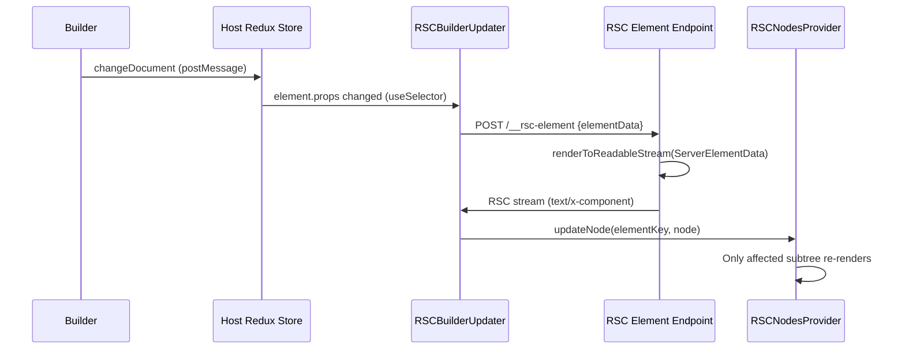

# RSC V2: Per-Element Subtree Replacement

## Problem

When the builder edits a prop, two parallel operations happen:

- **Path A (slow):** WebSocket to Makeswift API for DB persistence
- **Path B (fast):** postMessage to host Redux store

The current RSC refresh (triggered by Path B) re-fetches the full snapshot from the Makeswift API (Path A's destination), causing stale renders when Path A hasn't completed yet.

## Solution: V2 Per-Element Rendering

Instead of full-tree RSC refreshes, render only the changed server element on demand. Element data comes from the client Redux store (always fresh via Path B), never from the Makeswift API during edits.



## Key Architectural Changes

**Move RSCBuilderUpdater from server to client boundary:**

Currently `RSCBuilderUpdater` wraps `ServerElementData` inside the RSC node (in [server-element.tsx](packages/runtime/src/rsc/server/server-element.tsx)). This means replacing the RSC node unmounts the updater. Moving it to [element-data.tsx](packages/runtime/src/rsc/client/element-data.tsx) keeps it stable while its children (the RSC content) get replaced.

```
Before: RSCNodes[key] = <RSCBuilderUpdater><ServerElementData/></RSCBuilderUpdater>
After:  RSCNodes[key] = <ServerElementData/>
        RSCElementData renders: <RSCBuilderUpdater>{rscNode}</RSCBuilderUpdater>
```

**Stateful RSCNodesProvider:** The current [rsc-nodes-provider.tsx](packages/runtime/src/rsc/client/rsc-nodes-provider.tsx) passes a static map via context. It needs `useState` + `updateNode`/`removeNode` methods so individual entries can be replaced without touching the rest of the tree.

**Element-level server endpoint:** A new `POST /__rsc-element` route in [entry.rsc.tsx](apps/vite-cf-rsc/src/framework/entry.rsc.tsx) that renders a single `ServerElementData` via `renderToReadableStream`. Uses [React.cache()](packages/runtime/src/rsc/server/runtime.ts) for per-render isolation (same mechanism as the full-page render).

**FrameworkContext.refreshRSCElement:** A new callback in [framework-context.tsx](packages/runtime/src/runtimes/react/components/framework-context.tsx) that calls the element endpoint and returns the deserialized ReactNode. Implemented in [ViteRSCFrameworkProvider](packages/vite-rsc/src/framework-provider.tsx) using `createFromFetch` from `@vitejs/plugin-rsc/browser`. This avoids the runtime package needing Vite-specific imports.

## Files Changed

### `@makeswift/runtime` package

- **NEW** `packages/runtime/src/rsc/server/makeswift-component.tsx` -- `RSCMakeswiftComponent` server component (parallels [RSCMakeswiftPage](packages/runtime/src/rsc/server/makeswift-page.tsx)): calls `componentDocumentToRootEmbeddedDocument`, `prerenderRSCNodes`, wraps `MakeswiftComponent` with `RSCNodesProvider` + CSS infra
- **NEW** `packages/runtime/src/rsc/client/rsc-refresh-coordinator.tsx` -- Client component that handles middleware-dispatched custom events for new/removed RSC elements (calls `refreshRSCElement` + `updateNode`/`removeNode`)
- `packages/runtime/src/rsc/server/index.ts` -- Add `RSCMakeswiftComponent` export
- `packages/runtime/src/rsc/client/rsc-nodes-provider.tsx` -- Add `useState`, `updateNode(key, node)`, `removeNode(key)` with `startTransition`; export `useUpdateRSCNode`, `useRemoveRSCNode` hooks
- `packages/runtime/src/rsc/server/server-element.tsx` -- Remove `RSCBuilderUpdater` wrapper and `getSiteVersionFromCache` / `isPreview` check; always render bare `<ServerElementData>`
- `packages/runtime/src/rsc/client/element-data.tsx` -- Wrap server RSC nodes with `<RSCBuilderUpdater>` when `useIsPreview()` is true; import `useIsPreview` from `../../runtimes/react/hooks/use-is-preview`
- `packages/runtime/src/rsc/client/rsc-builder-updater.tsx` -- Replace `refreshRSC?.()` call with: (1) call `refreshRSCElement(elementData, documentContext)` from `useFrameworkContext()`, (2) call `updateRSCNode(elementKey, resultNode)`. Add `useEffect` listener for `makeswift:rsc-resource-changed` event to re-render on API resource changes
- `packages/runtime/src/rsc/client/refresh-middleware.ts` -- Add `CHANGE_API_RESOURCE` case that dispatches `makeswift:rsc-resource-changed` CustomEvent. For `CHANGE_ELEMENT_TREE`, dispatch `makeswift:rsc-element-added` with element data for new server elements, and `makeswift:rsc-element-removed` with element key for removed server elements
- `packages/runtime/src/runtimes/react/components/framework-context.tsx` -- Add `refreshRSCElement?: (elementData: ElementData, documentContext: { key: string; locale: string | null }) => Promise<ReactNode>` to the `FrameworkContext` type
- `packages/runtime/src/unstable-framework-support/index.ts` -- Export new types/functions as needed (e.g., `useUpdateRSCNode`)

### `@makeswift/vite-rsc` package

- `packages/vite-rsc/src/framework-provider.tsx` -- Implement `refreshRSCElement` using `createFromFetch` from `@vitejs/plugin-rsc/browser`, calling `POST /__rsc-element`; pass it in the `FrameworkContext` value
- `packages/vite-rsc/src/refresh-middleware.ts` -- The middleware no longer needs to call `refreshRSC()` for `CHANGE_ELEMENT_TREE` (element additions handled via custom events + coordinator). Keep the middleware for dispatching custom events only

### `apps/vite-cf-rsc` app

- `apps/vite-cf-rsc/src/root.tsx` -- Replace `RSCMakeswiftPage` with `RSCMakeswiftComponent` using `MakeswiftComponentType.Box` (`'./components/Box/index.js'`); update snapshot prop type from `MakeswiftPageSnapshot` to `MakeswiftComponentSnapshot`; include `RSCRefreshCoordinator` inside the `RSCMakeswiftComponent` tree
- `apps/vite-cf-rsc/src/framework/entry.rsc.tsx` -- (1) Switch initial load from `client.getPageSnapshot` to `client.getComponentSnapshot` with `MakeswiftComponentType.Box`. (2) Add `POST /__rsc-element` route BEFORE the `app.all('*')` catch-all. The endpoint: parses `{ elementData, documentContext }` from request body, sets up server state via `RSCServerProvider`-style calls (`setRuntime`, `setSiteVersion`, `setMakeswiftClient`, `setDocument`), then renders `<ServerElementData elementData={elementData} />` through `renderToReadableStream` and returns the RSC stream
- `apps/vite-cf-rsc/src/framework/entry.browser.tsx` -- The `makeswift:rsc-refresh` listener and `fetchRscPayload` can remain for HMR/navigation; Makeswift preview prop changes now bypass this path entirely

## Server State for Element Endpoint

The [runtime.ts](packages/runtime/src/rsc/server/runtime.ts) module uses `React.cache()` for per-render isolation. The element endpoint needs the same setup as a full render. Create a thin server component wrapper:

```typescript
// In entry.rsc.tsx or a shared server module
function ElementRenderContext({ children }: { children: React.ReactNode }) {
  // These use React.cache() so they're scoped to this render
  setRuntime(runtime)
  setSiteVersion(siteVersion)
  setMakeswiftClient(client)
  setDocument(minimalDocument)
  return children
}
```

The `document` only needs `key` and `locale` (used by [serverResourceResolver](packages/runtime/src/rsc/server/resource-resolver.ts) lines 29, 46-58). The `rootElement` field can be set to the `elementData` itself to satisfy the type.

## changeApiResource Handling

When the builder changes an API resource (swatch, typography, etc.), the middleware dispatches a `makeswift:rsc-resource-changed` CustomEvent. Each mounted `RSCBuilderUpdater` listens for this event and re-renders its element via the `/__rsc-element` endpoint. This means N server renders (one per server element) on resource changes, which is acceptable for this spike.
